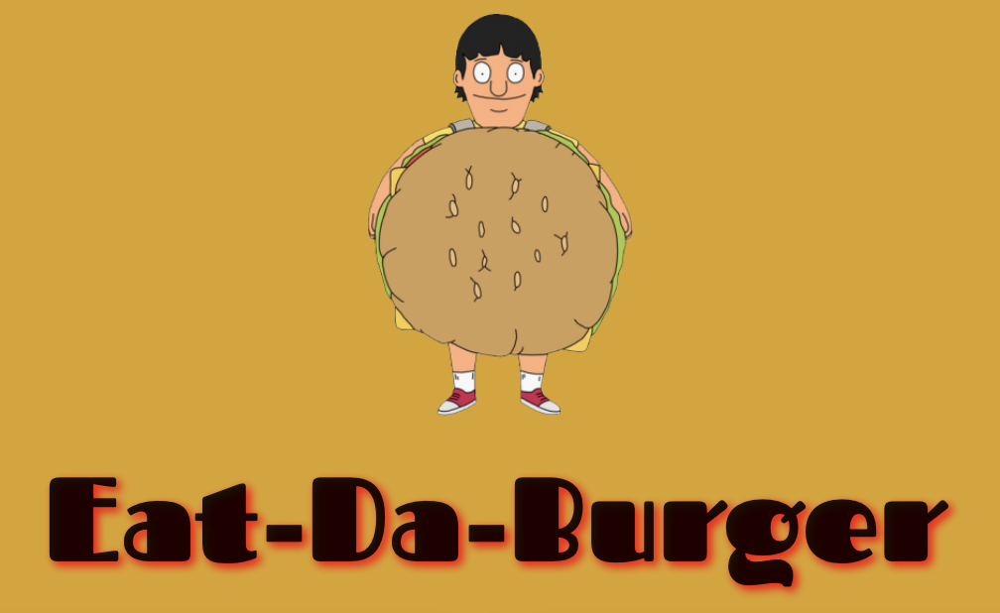
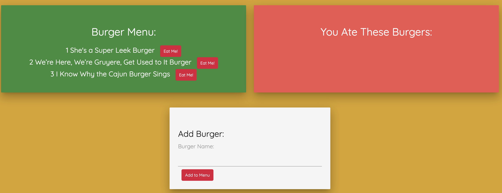
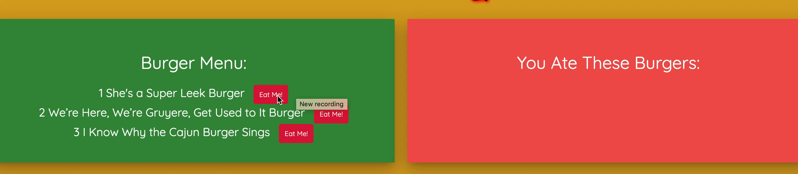
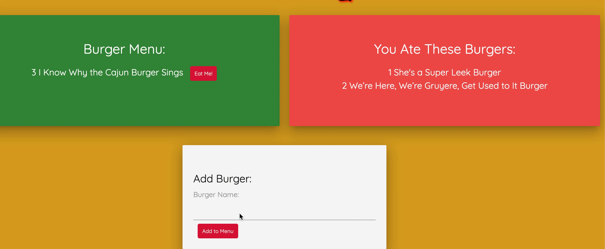

# Eat-Da-Burger

### Welcome to my burger app!
 

Upon opening you'll be greeted by our Burger Boy, eager to take your order. 
You'll then see the menu of some local favorites and an option for you to put in your own custom burger.  



### FUNctionality
Using an ORM, the app has 3 basic CRUD functions...

* READ from a database and display using Handlebars
* UPDATE a burger by clicking the "Eat Me" button 
* CREATE a new burger using the "Add to Menu" form

**Examples of app in action**  
  


  


### Deploying/Using My App

You can check out my site on Heroku!

Or....

You can also set it up locally by following these instructions:  

* Clone the repo 
```
git clone <repo>
```
* Navigate into the directory and install the dependencies. 
``` 
cd <repo>
npm install 
```
* Create MySQL database using the db/schema.sql & db/seeds.sql files. 
* Check database settings in the config folder.
* Get the server running by running the following command.
```
node server.js (could also use nodemon in place of node)
```
* Go to localhost:8080 in your browser and get to adding and eating burgers!

### Technologies Used
* Node JS
* Express 
* Handlebars 
* MySQL
* ORM (Object Relational Mapping)
* jQuery and AJAX
* Materialize and Custom CSS  

_Disclaimer: This app is not affiliated with Bob's Burgers, I'm just a fan._
